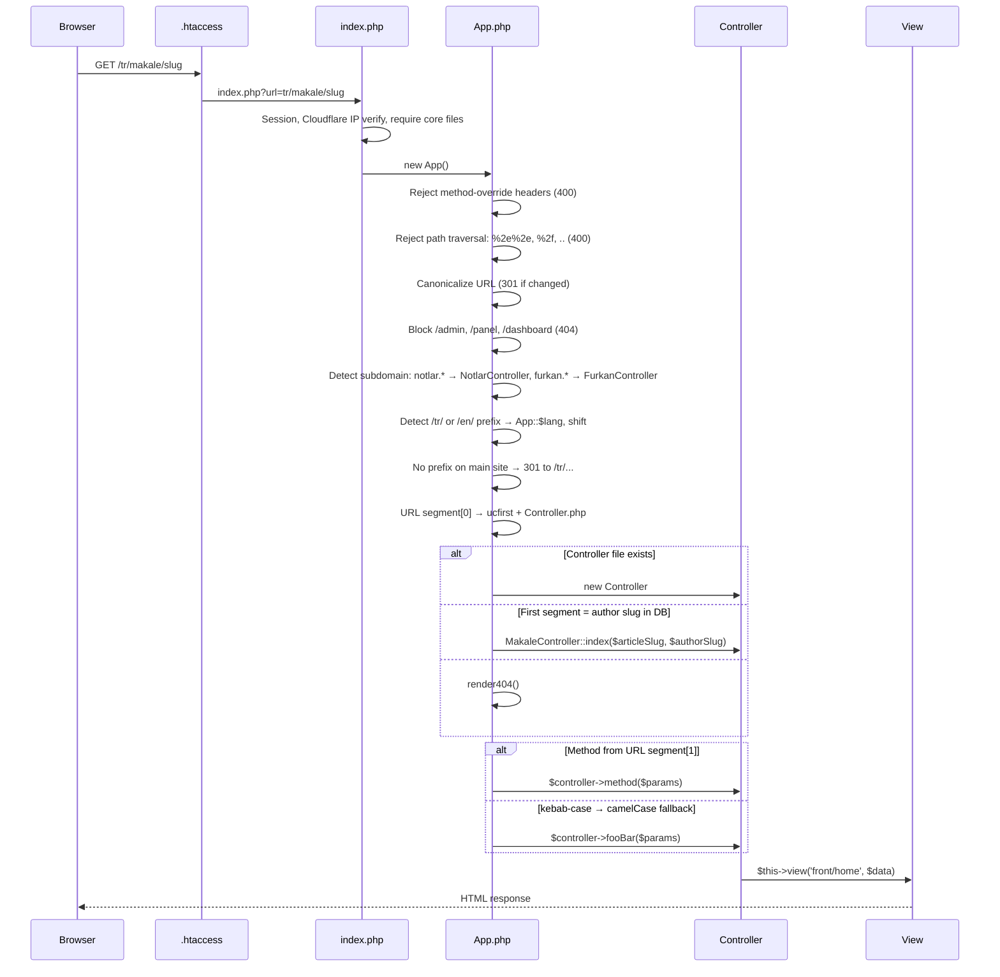
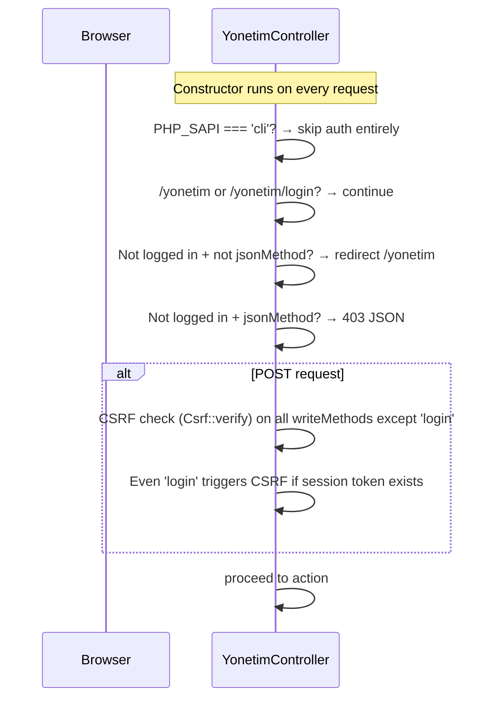
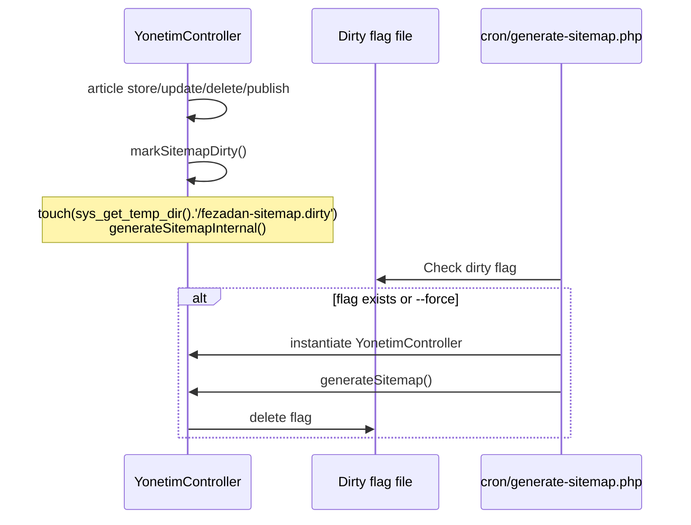
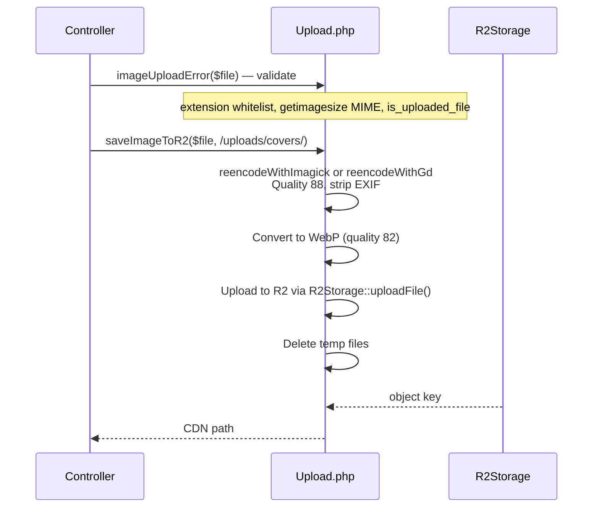
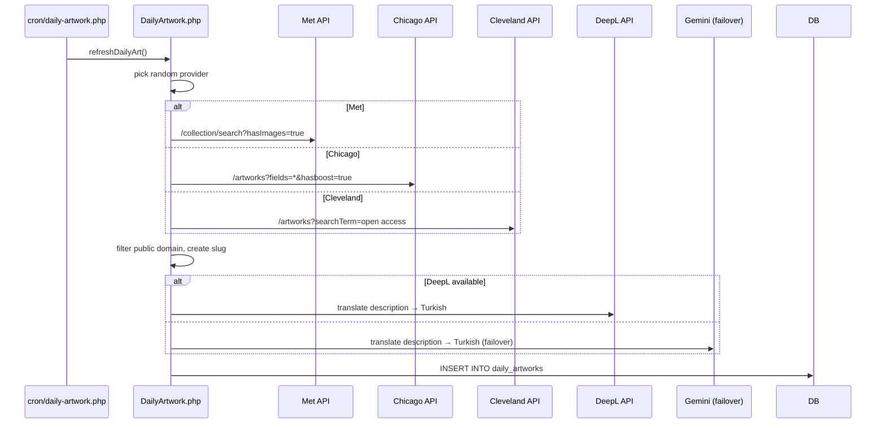
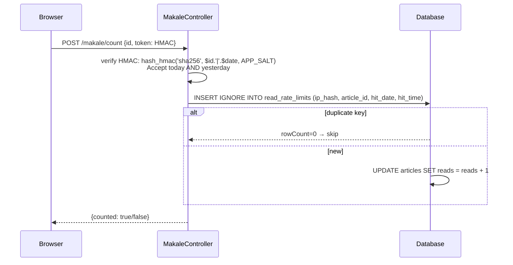

# Fezadan — Technical Analysis

Reference companion for the Fezadan publishing platform. Diagrams show real code paths; prose is kept minimal.

---

## 1. System Overview

```
fezadan.org           → Main publishing site (articles, authors, categories)
notlar.fezadan.org    → Academic PDF archive (notes module)
furkan.fezadan.org    → Portfolio/gallery subdomain
cdn.fezadan.org       → Cloudflare R2 CDN (media delivery)
```

Single PHP codebase, no framework, custom MVC. Database: MySQL/MariaDB. Media: Cloudflare R2.

---

## 2. Database Schema

All tables from `fezadano5_site.sql`:

| Table | Engine | Purpose |
|-------|--------|---------|
| `admins` | MyISAM | Admin users (id, username, name, password bcrypt, last_login) |
| `articles` | MyISAM | Articles (id, title, slug, short_desc, content, svg, image_url, author_id, status, refs, reads, lang, seo_*, translation_of) |
| `article_categories` | MyISAM | Many-to-many: article ↔ category |
| `authors` | InnoDB | Authors (id, name, slug, bio, image_url, social links) |
| `categories` | MyISAM | Category names and slugs |
| `daily_artworks` | InnoDB | Daily art from Met/Chicago/Cleveland APIs (id, date, slug, title, artist, medium, image_url, description_tr, provider) |
| `download_rate_limits` | InnoDB | Rate limit: ip_hash per minute |
| `login_attempts` | MyISAM | Brute-force tracking: ip_hash, attempt_time |
| `notes` | MyISAM | PDF archive (id, title, slug, description, r2_path, file_size, uploader_name, lang, downloads) |
| `note_categories` | MyISAM | Many-to-many: note ↔ category |
| `patch_notes` | MyISAM | Admin changelog (id, version, title, content, author, created_at) |
| `portfolio_items` | InnoDB | Portfolio items (created via self-healing migration) |
| `read_rate_limits` | InnoDB | Rate limit: UNIQUE(ip_hash, article_id, hit_date) |

### Key indexes
- `articles.slug` — UNIQUE
- `authors.slug` — UNIQUE
- `notes.slug` — UNIQUE
- `daily_artworks.date` — UNIQUE
- `read_rate_limits` — UNIQUE(ip_hash, article_id, hit_date)
- `article_categories` — PRIMARY KEY(article_id, category_id)

---

## 3. Request Flow (App.php)



### Subdomain routing (App.php:120-179)

```
furkan.fezadan.org/*
  → FurkanController
  Routes: / → index, /yonetim → yonetim, /store → store, /delete → delete, /reorder → reorder

notlar.fezadan.org/*
  → NotlarController (GET/HEAD only — 405 for other methods)
  Routes: / → index, /not/{slug} → read, /not/view/{slug} → viewPdf, /not/download/{slug} → download
```

### Language routing
- Main site (`fezadan.org`): `/tr/` or `/en/` prefix mandatory
- `App::$lang` set from prefix
- Subdomains skip language logic entirely

---

## 4. Admin Panel — Auth & CSRF



Write methods: `login, logout, store, update, delete, publish, storeCategory, deleteCategory, storePatch, patchDelete, authorStore, authorDelete, storeNote, updateNote, deleteNote, updatePassword, uploadContentImage, refreshDailyArt, updateArtDescription, generateSitemap, generateSeo`

JSON endpoints: `uploadContentImage, generateSeo` (return JSON, not redirects)

### Brute-force protection
1. Delete attempts older than 3 hours
2. Count attempts for IP hash (today's salt)
3. If ≥ 3 → block login
4. On success: clear attempts, `session_regenerate_id(true)`, reset `$_SESSION`

IP hash: `hash('sha256', $ip . date('Y-m-d') . APP_SALT)` — changes daily

---

## 5. Sitemap Generation



Two sitemaps:
- `sitemap_main.xml` — articles (language-prefixed with author slug), authors, categories, static pages
- `sitemap_notes.xml` — note slugs at `/not/{slug}`

Host-specific serving via `.htaccess` RewriteRule based on `HTTP_HOST`.

---

## 6. Media Upload Pipeline



Upload types:
| Type | Path | Max | Processing |
|------|------|-----|------------|
| Cover | `/uploads/covers/` | 5MB | re-encode → WebP |
| Content | `/uploads/content/` | 5MB | re-encode → WebP |
| Author | `/uploads/authors/` | 5MB | re-encode → WebP |
| Portfolio | `/portfolio/` | 20MB | no re-encode |
| PDF notes | `/notlar/` | 50MB | validate magic bytes `%PDF-` |

---

## 7. R2Storage — CDN Layer

Singleton in `App\Core`. Uses `Aws\S3\S3Client` with `region: auto`.

Key methods:
- `uploadFile($source, $objectKey, $contentType)` → object key or null
- `uploadPDF($tempPath, $originalFileName)` → prefixed `notlar/` or false
- `streamView($objectKey, $displayName)` → 206 Partial Content for PDF.js
- `streamPublicFile($objectKey)` → images only, verifies no `..` in key
- `streamDownload($objectKey, $displayName)` → forced download

Cache headers: `Cache-Control: public, max-age=31536000, immutable`

`Upload::assetUrl()` resolves paths:
- `/uploads/*` → `CDN_URL` (falls back `CDN_URL → R2_PUBLIC_URL → SITE_URL`)
- Full URL on same host → CDN domain rewrite

---

## 8. Daily Artwork System



Providers: Metropolitan Museum of Art, Art Institute of Chicago, Cleveland Museum of Art.

Failover chain: DeepL → Gemini AI.

---

## 9. Security Mechanisms

| Threat | Mitigation | Location |
|--------|-------------|----------|
| IP exposure | Daily-salt hash: `sha256($ip . date('Y-m-d') . APP_SALT)` | YonetimController, read/download rate limiting |
| Session fixation | `session_regenerate_id(true)` on login | YonetimController |
| CSRF | `Csrf::verify()` with `hash_equals()` timing-safe compare | Csrf.php |
| Path traversal | Reject `%2e%2e`, `%2f`, `..`, `.` with 400 | App.php:29-56 |
| Admin discovery | `/admin`, `/panel`, `/dashboard` → 404 | App.php:71-79 |
| SQL injection | `ATTR_EMULATE_PREPARES=false` + whitelist ORDER BY | YonetimController |
| File polyglot | Re-encode images (Imagick/GD) strips EXIF/payloads | Upload.php |
| Sensitive files | `.env`, `composer.json`, `*.sql` blocked via `[F]` | .htaccess |
| App dir access | `Deny from all` in `app/.htaccess` | app/.htaccess |
| Method override | `X-HTTP-Method-Override` etc. → 400 | App.php:13-20 |

---

## 10. Read Count & Rate Limiting



Rate limit: one count per IP per article per day (UNIQUE constraint on ip_hash, article_id, hit_date).

---

## 11. Key Files Reference

| File | Purpose |
|------|---------|
| `app/Core/App.php` | Router, subdomain dispatch, language prefix, path traversal blocking |
| `app/Core/Db.php` | Singleton PDO, self-healing migrations on first connect |
| `app/Core/Controller.php` | `view()`, `createSlug()`, `uniqueSlug()` |
| `app/Core/Upload.php` | Image validation, re-encode, WebP conversion, R2 upload |
| `app/Core/R2Storage.php` | S3 client, streamView with Range support, streamDownload |
| `app/Core/Csrf.php` | Token generation/verification via `hash_equals()` |
| `app/Core/Flash.php` | Session flash messages |
| `app/Core/AdminLog.php` | JSON logs to `ROOT/logs/admin.log`, 1MB rotation |
| `app/Core/GeminiService.php` | SEO generation via Gemini 2.5 Flash API |
| `app/Controllers/YonetimController.php` | 20+ admin actions, auth gate, CSRF, brute-force |
| `app/Controllers/NotlarController.php` | PDF archive: index, read, viewPdf, download (rate limited) |
| `app/Controllers/FurkanController.php` | Portfolio: index, yonetim, store, delete, reorder |
| `app/Config/config.php` | Custom `.env` parser, `env_value()`, `langUrl()`, `articleUrl()` |
| `public_html/index.php` | Entry point: session, Cloudflare IP, error reporting, require chain |
| `public_html/.htaccess` | Apache rewrite, security headers, host-specific sitemap/robots |
| `cron/generate-sitemap.php` | Checks dirty flag, regenerates sitemaps |
| `fezadano5_site.sql` | Full database dump with all schema and data |

---

## 12. CSS / Tailwind Build

```
Source:  public_html/assets/css/input.css
Output:  public_html/assets/css/style.css

npm run dev   → npx @tailwindcss/cli --watch
npm run build → npx @tailwindcss/cli --minify
```

`input.css`: `@import "tailwindcss"` + `@theme { --color-main, --color-paper, --color-accent }`

Font stack: Syne, EB Garamond, Space Grotesk, Bebas Neue, JetBrains Mono — all local WOFF2.

Color tokens via CSS custom properties on `<html>` (light/dark via `data-theme` attribute).