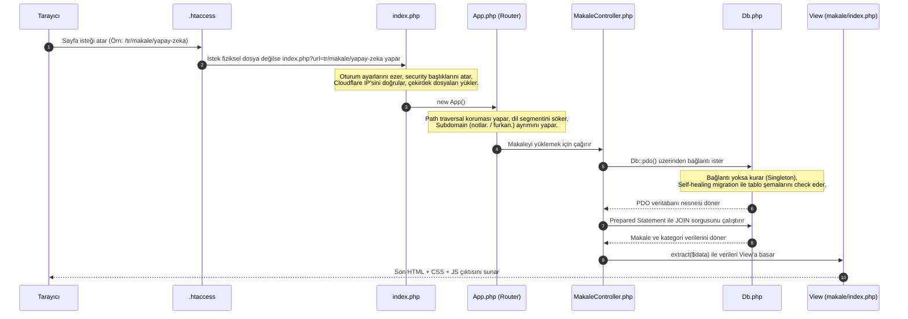

# Selam Geliştirici Dostum! Fezadan Projesinin Gizli Kahramanları 🚀 (Derinlemesine Güvenlik & Performans Analizi)

Eğer projenin kodlarını incelerken *"Ya burada niye böyle bir kod var?"*, *"Neden direkt resmi klasöre kaydetmemişler?"*, *"Bu IP'yi niye hash'lemişler?"* gibi sorular kafanı kurcaladıysa, doğru yerdesin! 

Sıcak bir kahve daha doldur, çünkü bu rehberde web programlamada **"Genellikle yapılan ölümcül hatalar"** ile **"Fezadan projesinde uygulanan profesyonel çözümler"** arasındaki farkları göreceğiz. Güvenlik zırhlarından CDN sihirlerine kadar her detayı inceliyoruz.

---

## 1. MVC İstek Akışı (Sequence Diagram)
Gelen bir isteğin sunucuda izlediği rota ve tetiklenen dosyalar:



---

## 2. Alınan Güvenlik Önlemleri (Normalde Neler İhmal Edilir, Burada Ne Yapıldı?)

Birçok web sitesi "çalışıyor işte" mantığıyla yayına alınır ancak arkada bırakılan devasa açıklar saldırganların ekmeğine yağ sürer. Fezadan projesinde bu duruma karşı çok ciddi önlemler alınmıştır:

### A. Mahremiyet Odaklı & GDPR/KVKK Uyumlu IP Limitlendirmesi (Rate Limiting)
*   **İhmal Edilen Yöntem:** Çoğu yazılımcı, admin paneline yapılan hatalı girişleri veritabanına kullanıcının yalın IP adresini (`192.168.1.1` gibi) yazarak kaydeder. Bu durum GDPR/KVKK regülasyonlarına göre **"Kişisel Verilerin Korunması Kanunu"** ihlalidir; çünkü IP adresi kişisel veridir.
*   **Fezadan'daki Çözüm ([YonetimController:L285-289](file:///d:/Fezadan%20Main/Fezadan/app/Controllers/YonetimController.php#L285-289)):**
    ```php
    $userIp = $_SERVER['REMOTE_ADDR'] ?? 'unknown';
    $dailySalt = date('Y-m-d') . APP_SALT; 
    $ipHash = hash('sha256', $userIp . $dailySalt);
    ```
    Burada kullanıcının gerçek IP'si veritabanına asla ham olarak yazılmaz! Günün tarihi (`date('Y-m-d')`) ve `.env` dosyasındaki gizli şifreleme tuzu (`APP_SALT`) ile birleştirilerek SHA-256 ile hash'lenir. 
    Böylece veritabanı çalınsa bile kimsenin IP adresi ifşa olmaz. Tarih bilgisi eklendiği için de her gün hash değerleri değişir (Geriye dönük takip imkansızlaşır), ama aynı gün içindeki 3 hatalı denemeyi tespit edip brute-force (kaba kuvvet) saldırılarını engellemeye yeterlidir.

### B. Session Fixation (Oturum Sabitleme) Saldırısı Engelleme
*   **İhmal Edilen Yöntem:** Admin girişi yapıldıktan sonra sadece `$_SESSION['logged_in'] = true` yazılıp geçilir. Saldırgan, kurbana önceden belirlediği bir Session ID'yi (örneğin URL parametresiyle) enjekte eder. Kullanıcı giriş yaptığında o Session ID aktif kalırsa, saldırgan da aynı oturum kimliğiyle sisteme admin olarak sızar.
*   **Fezadan'daki Çözüm ([YonetimController:L317-320](file:///d:/Fezadan%20Main/Fezadan/app/Controllers/YonetimController.php#L317-320)):**
    Giriş başarılı olduğu an `session_regenerate_id(true)` çağrılarak eski oturum kimliği tamamen imha edilir ve tarayıcıya yepyeni bir oturum kimliği atanır. Ardından `$_SESSION = []` ile önceki tüm çöp veriler sıfırlanıp temiz bir sayfa açılır.

### C. CSRF Güvenliği ve Zaman Aşımı Saldırılarına (Timing Attacks) Karşı Koruma
*   **İhmal Edilen Yöntem:** CSRF token'ı doğrulanırken `if ($_POST['token'] == $_SESSION['token'])` şeklinde basit bir string karşılaştırması yapılır. Bu yöntem, PHP'nin string karakterlerini baştan sona doğru teker teker karşılaştırmasından ötürü milisaniyelik zaman farkları (timing attacks) yaratarak token'ın tahmin edilmesine izin verebilir.
*   **Fezadan'daki Çözüm ([Csrf.php:L28](file:///d:/Fezadan%20Main/Fezadan/app/Core/Csrf.php#L28)):**
    Token doğrulaması `hash_equals($stored, $sent)` fonksiyonu ile yapılır. Bu fonksiyon, iki string'i karşılaştırırken karakterler ne kadar uyuşursa uyuşsun **her zaman tam olarak aynı sürede** yanıt verir. Bu sayede saldırganların zamanlama analizi yaparak token sızdırması engellenir.

### D. Dosya Yükleme Zırhlaması (EXIF / Polyglot Payload Kırma)
*   **İhmal Edilen Yöntem:** Kullanıcının yüklediği dosyanın sadece uzantısına (`.jpg` mi diye) bakılır veya `move_uploaded_file()` ile olduğu gibi sunucuya taşınır. Saldırganlar bir resim dosyasının EXIF meta verilerinin (kamera bilgisi, çekim yeri vb.) içerisine zararlı PHP kodları gizlerler (buna Polyglot denir). Dosya sunucuya yüklendiğinde bir şekilde çalıştırılırsa sunucu hacklenir.
*   **Fezadan'daki Çözüm ([Upload.php:L121-204](file:///d:/Fezadan%20Main/Fezadan/app/Core/Upload.php#L121-204)):**
    1.  `getimagesize()` ile dosyanın sadece uzantısı değil, gerçek piksel yapısı ve MIME türü doğrulanır.
    2.  Resim sunucuya kaydedilmeden önce **Imagick** veya **GD** kütüphanesi kullanılarak hafızada yeniden çizilir (`reencodeWithImagick` ve `reencodeWithGd`). Bu işlem, resmin içindeki tüm EXIF meta verilerini ve gizlenmiş zararlı PHP kodlarını (payload) fiziksel olarak parçalar ve yok eder. Geriye sadece temiz piksel verileri kalır.
    3.  Ayrıca resimler otomatik olarak WebP formatına dönüştürülerek optimize edilir.

### E. Path Traversal (Dizin Aşımı) ve safeUnlinkUpload
*   **İhmal Edilen Yöntem:** Veritabanından veya formdan gelen dosya yolu doğrudan silinir: `unlink($_POST['file_path'])`. Saldırgan gönderdiği parametreye `../../index.php` yazarak sitenin ana kodlarını sunucudan silebilir!
*   **Fezadan'daki Çözüm ([YonetimController:L770-795](file:///d:/Fezadan%20Main/Fezadan/app/Controllers/YonetimController.php#L770-795)):**
    `safeUnlinkUpload()` fonksiyonu, silinmek istenen dosyanın yolunda `..` olup olmadığını kontrol eder. Ayrıca dosyanın mutlaka `/uploads/` diziniyle başlamasını şart koşar. Aksi takdirde silme işlemi kesinlikle reddedilir.

### F. SQL Injection Engellemede "Yazılmayan Kural": `ORDER BY` Whitelisting
*   **İhmal Edilen Yöntem:** SQL'de prepared statement (`$pdo->prepare`) kullanmak sorguları SQL Injection'dan korur. Ancak prepared statement'lar `ORDER BY` kolon isimlerinde veya `ASC/DESC` yönlerinde **çalışmaz**. Yazılımcılar genelde sıralama kolonunu URL'den geldiği gibi sorguya eklerler: `ORDER BY " . $_GET['sort'] . " DESC`. Bu da devasa bir SQL Injection açığı yaratır.
*   **Fezadan'daki Çözüm ([YonetimController:L379-394](file:///d:/Fezadan%20Main/Fezadan/app/Controllers/YonetimController.php#L379-394)):**
    Sıralama parametresi alınırken sıkı bir whitelist kontrolü yapılır:
    ```php
    $allowedSorts = [
        'id' => 'a.id',
        'title' => 'a.title',
        'reads' => 'a.reads',
        'author' => 'author_name'
    ];
    if (!array_key_exists($sort, $allowedSorts)) {
        $sort = 'id'; // Geçersiz kolon gelirse varsayılana çekilir
    }
    ```
    Sadece izin verilen kolon isimleri SQL sorgusuna dahil edilir. Dışarıdan gelen kirli veri SQL sorgusuna asla doğrudan sızamaz.

---

## 3. Neden Bulut Depolama (Cloudflare R2) ve CDN Tercih Edildi?

Pek çok web sitesi görsellerini ve dosyalarını web sunucusunun (örneğin cPanel shared hosting diski) içinde saklar. Fezadan projesinde ise dosyalar **Cloudflare R2** (AWS S3 uyumlu bulut depolama) üzerine yüklenir ve oradan sunulur. Neden mi?

```
[ Gelen İstek ] ──> [ Sunucu (Apache/LiteSpeed) ] ──> (Sadece PHP çalıştırır)
                          │
                   (Medya Dosyaları)
                          │
                          ▼
             [ Cloudflare R2 / CDN ] ───> [ Kullanıcının Tarayıcısı ]
             (Global olarak en yakın edge sunucudan ışık hızında besler)
```

1.  **Shared Hosting Limitlerini Aşmak (Storage & Inode Limit):** Paylaşımlı sunucularda disk alanı sınırlıdır. Daha da önemlisi **Inode** (dosya adedi) limiti vardır. Sisteme yüklenen yüzlerce görsel ve PDF dosyası sunucu sınırlarını hızla tüketir. R2 kullanarak sunucunun diski tamamen boş ve hafif tutulur.
2.  **Yedekleme Kolaylığı:** Sunucunun yedeğini alırken gigabaytlarca resim/PDF dosyasını yedeklemek zaman alır ve sunucuyu kilitler. Dosyalar bulutta olduğundan, sadece birkaç megabaytlık PHP kodlarını yedeklemek saniyeler sürer.
3.  **Küresel Dağıtım (Low Latency):** Cloudflare CDN, görselleri tüm dünyadaki yüzlerce sunucusunda (Edge) önbelleğe alır. Amerika'dan giren bir ziyaretçi resmi Türkiye'deki sunucudan indirmek yerine kendisine en yakın lokasyondaki Cloudflare sunucusundan milisaniyeler içinde indirir.
4.  **CPU Offloading (Sunucu Yükünü Hafifletme):** Tarayıcılar aynı anda sunucudan 10-15 tane görsel çekmeye çalışırken sunucunun bağlantı limitlerini doldurabilir. Dosyalar CDN'den çağrıldığında, ana web sunucusu (LiteSpeed) statik resim dosyalarını sunmakla zaman kaybetmez, tüm gücünü PHP kodlarını çalıştırmaya ayırır.

---

## 4. Hız ve Performans İçin Yapılan Diğer İnce İşler

Projenin hızlı yüklenmesi ve Google PageSpeed puanlarının yüksek olması için kod tarafında şu optimizasyonlar uygulanmıştır:

### A. TCP El Sıkışmasını (Handshake) Azaltmak: Tekil PDO (Singleton-like)
Her sorguda `new PDO(...)` yazıp veritabanı bağlantısı açmak sunucunun her seferinde MySQL ile sıfırdan el sıkışmasına (TCP/auth handshake) neden olur. Bu da sayfa açılış hızını ciddi oranda yavaşlatır.
[Db.php](file:///d:/Fezadan%20Main/Fezadan/app/Core/Db.php) sınıfı sayesinde, sunucuya gelen bir istek sonlanana kadar **sadece tek bir bağlantı** açık tutulur. Tüm sorgular bu ortak tüneli kullanır. Sayfa bittiğinde bağlantı otomatik kapanır.

### B. PDF'ler İçin HTTP Range Requests (Kısmi İçerik 206)
Büyük boyutlu PDF notları indirilirken tarayıcı tüm dosyayı bir kerede indirmek yerine parça parça çekmek isteyebilir (örneğin ilk 3 sayfayı göstermek için).
[R2Storage.php:L179-227](file:///d:/Fezadan%20Main/Fezadan/app/Core/R2Storage.php#L179-227) içindeki akış sayesinde tarayıcının gönderdiği `HTTP_RANGE` başlığı (`Range: bytes=0-1023` gibi) yakalanır. R2'den sadece o byte'lar çekilip tarayıcıya `206 Partial Content` başlığıyla gönderilir. Böylece kullanıcı 50 MB'lık PDF dosyasının tamamen inmesini beklemeden saniyeler içinde ilk sayfayı okumaya başlar.

### C. Sayfa Önbelleğinde "Immutable" (Değişmez) Gücü
`.htaccess` dosyasında statik dosyalar için şu header tanımlanmıştır:
`Header set Cache-Control "max-age=31536000, public, immutable"`
Buradaki `immutable` anahtar kelimesi tarayıcıya şunu söyler: *"Bu dosya (örneğin `logo-hash123.webp`) sunucuda asla güncellenmeyecek. Sayfayı yenilesen bile sunucuya gidip 'bu dosya değişti mi?' (304 Not Modified sorgusu) diye sorma! Doğrudan diskten oku."* Bu sayede sunucuya giden gereksiz HTTP istek trafiği sıfıra indirilir.

### D. LiteSpeed ve LSPHP Sunucu Uyumlaştırması (500 Hatalarının Önlenmesi)
*   **İhmal Edilen Yöntem:** PHP limitlerini artırmak için `.htaccess` dosyasına doğrudan `php_value upload_max_filesize 20M` yazılır. Sunucu LiteSpeed (LSPHP) veya PHP-FPM kullanıyorsa, `.htaccess` içindeki ham `php_value` ifadeleri sunucuyu çökerterek **500 Internal Server Error** hatasına neden olur.
*   **Fezadan'daki Çözüm:**
    1.  `.htaccess` içindeki tüm `php_value` komutları Apache modüllerini kontrol eden `<IfModule mod_php.c>`, `<IfModule mod_php7.c>` ve `<IfModule mod_php8.c>` blokları içerisine alınmıştır. LiteSpeed bu blokları hata vermeden pas geçer.
    2.  LiteSpeed sunucunun bu PHP ayarlarını (bellek limitleri, upload sınırları vb.) okuması için dizinde [.user.ini](file:///d:/Fezadan%20Main/Fezadan/public_html/.user.ini) dosyası kullanılır. LiteSpeed bu dosyayı yerel olarak algılar ve limitleri sorunsuzca uygular.
    3.  Ayrıca dynamic session ve temp directory yolları `index.php` içinde çalışma zamanında (`ini_set()`) de doğrulanır.


---

## 5. Genellikle Yapılan Hatalar vs. Fezadan Projesinin Farkı

Piyasadaki pek çok PHP projesinde karşılaştığımız hataları ve Fezadan'ın bu hataları nasıl çözdüğünü karşılaştıralım:

| Yapılan Yanlış Pratik (Bad Practice) | Fezadan Projesindeki Doğru Çözüm | Neden Önemli? |
| :--- | :--- | :--- |
| Oturum (Session) dosyalarının sunucunun ortak `/tmp` klasöründe saklanması. | `session.save_path` ile oturumları `/home/fezadano5/tmp/sessions` altında izole etmek. | Aynı paylaşımlı sunucudaki (shared hosting) diğer sitelerin sahipleri senin kullanıcı oturumlarını okuyamaz. |
| `.env` dosyasının veya `.git` klasörünün webden erişilebilir olması. | `.htaccess` kurallarıyla hassas dosya ve klasörleri doğrudan bloklamak (`[F,L]`). | Dışarıdan bir saldırganın site şifrelerini veya kaynak kod geçmişini tarayıcıdan indirmesini engeller. |
| `$_SERVER['REMOTE_ADDR']` değerini Cloudflare arkasındayken direkt kullanmak. | Cloudflare IP bloklarını doğrulamadan IP almama kontrolü (`get_secure_remote_ip`). | Saldırganların sahte HTTP başlıkları göndererek kendilerini farklı bir IP'den geliyormuş gibi göstermesini (IP Spoofing) önler. |
| Yüklenen görselleri kullanıcının verdiği isimle doğrudan klasöre kaydetmek. | Görsel isimlerini `slugify` edip sonuna rastgele `random_bytes` eklemek ve R2'ye yüklemek. | Dosya adı üzerinden yapılacak **XSS** ve **Path Traversal** açıklarını engeller, Türkçe karakter sorunlarını çözer. |
| DB sorgularında `SELECT * FROM articles` yapıp kategorileri PHP döngüsüyle tek tek çekmek (N+1 Sorgusu). | `LEFT JOIN` ve `GROUP_CONCAT` kullanarak tüm ilişkileri tek bir SQL sorgusuyla almak. | Veritabanı sorgu trafiğini 10 kat azaltır, sunucunun yorulmasını ve yavaşlamasını engeller. |

---

Fezadan projesi, dışarıdan basit bir blog/not sitesi gibi görünse de arka planda son derece olgun, güvenlik bilinci yüksek ve performans kaygısıyla yazılmış temiz bir mimariye sahip. 

Başka bir kısmı merak ediyorsan ya da kod üzerinde yeni bir özellik denemek istersen çekinmeden sorabilirsin! 😉
